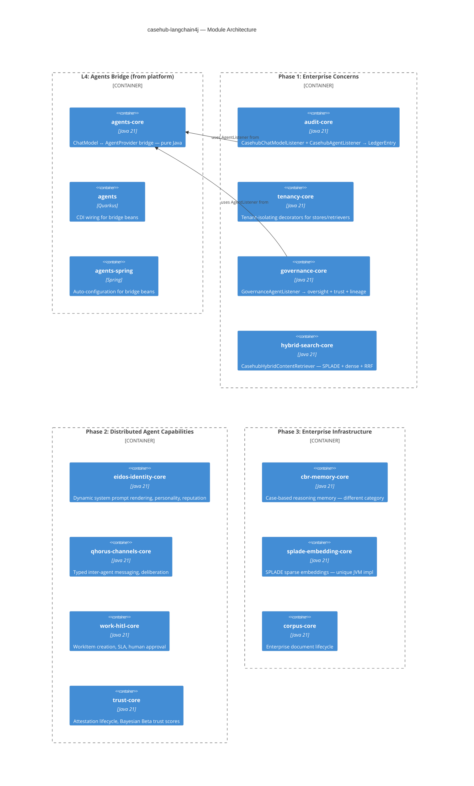
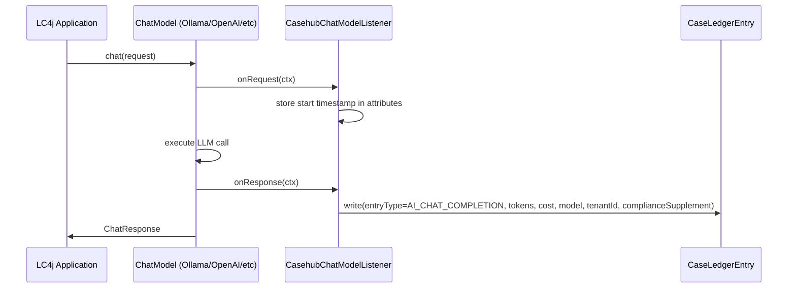
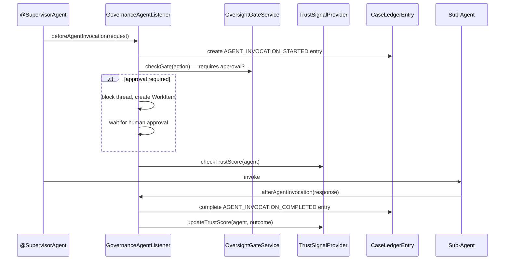
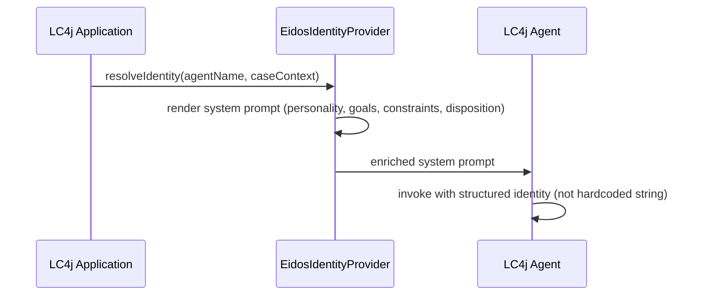
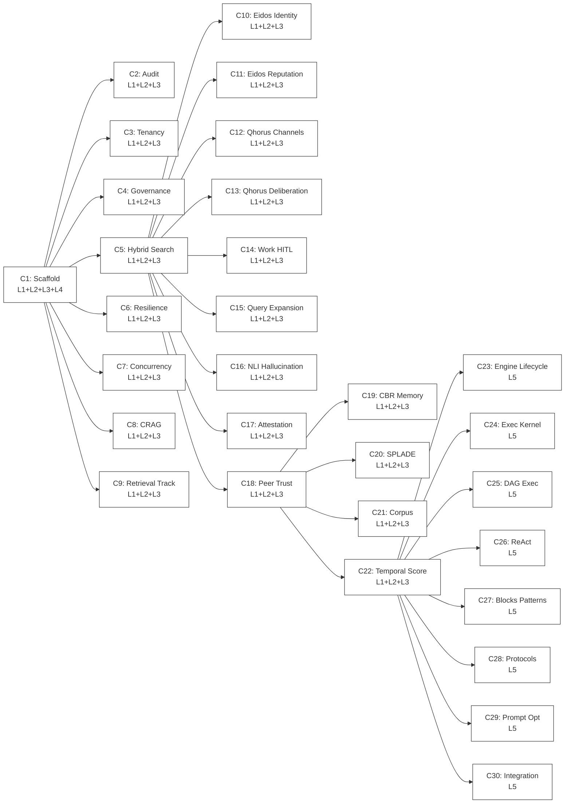

# casehub-langchain4j — ARC42STORIES.MD

**Spec:** Arc42Stories v0.1
**Profile:** CaseHub — Integration tier
**Profile ref:** `../parent/docs/arc42stories-casehub-profile.md` · fallback: `https://raw.githubusercontent.com/casehubio/parent/main/docs/arc42stories-casehub-profile.md`
**Build position:** Integration tier — depends on platform, ledger, neocortex, engine, eidos, qhorus, work, blocks. No downstream casehubio dependents.
**Consumed by:** Application-tier repos (aml, clinical, devtown, soc, life) and external LC4j developers
**Depends on:** casehub-platform, casehub-ledger, casehub-neocortex, casehub-engine, casehub-eidos, casehub-qhorus, casehub-work, casehub-blocks, langchain4j-core, langchain4j-agentic

---

## §1 Introduction and Goals

### Description

`casehub-langchain4j` provides enterprise enrichment for LangChain4j applications. It is **complementary** to langchain4j, not competitive. The developer keeps their chosen LC4j providers, stores, and patterns. CaseHub adds enterprise concerns that langchain4j deliberately does not handle.

Four phases, each telling a clear story to an LC4j developer:

1. **"Your LC4j app is now enterprise-class"** — audit trails, tenant isolation, governance, resilience. Decorators and classpath activation.
2. **"Your LC4j agents are now real distributed agents"** — structured identity (eidos), typed channels (qhorus), human-in-the-loop (work), hallucination detection (neocortex), earned trust (ledger). Novel capabilities LC4j doesn't have.
3. **"Your LC4j app has enterprise-grade infrastructure"** — CBR memory, SPLADE embeddings, corpus management. Enterprise SPI implementations where LC4j has acknowledged gaps.
4. **"Your LC4j agents are orchestrated by CaseHub"** — case lifecycle, execution kernel, DAG dispatch, orchestration patterns. Full platform integration.

**Strategic positioning:** This work is designed for complementary engagement with the LC4j community. Phase 1+2 demonstrate value that doesn't threaten LC4j's core. The conversation opens with "here's what we built on top of your framework." Phase 4 is where natural migration happens — the developer has seen enough value that they want the full stack.

Module structure per SPI: `-core` (pure Java), bare name (Quarkus CDI), `-spring` (Spring auto-config). The agents bridge (ChatModel ↔ AgentProvider, moved from platform) is the foundation all modules build on.

### Artifact Schema

| Artifact type | Format | Example | Where it lives |
|---|---|---|---|
| Issue | `#NNN` or `casehubio/casehub-langchain4j#NNN` | `#1` | GitHub Issues |
| ADR | `ADR-NNNN` | `ADR-0001` | `docs/adr/` |
| Design spec | `YYYY-MM-DD-topic-design` | `2026-09-24-phase-1-enterprise-concerns` | workspace `specs/` |
| Blog entry | `YYYY-MM-DD-[initials]NN-title` | `2026-10-01-dt01-title` | workspace `blog/` |

Integration tier uses issue refs directly — no improvement log prefix.

### Stakeholders

| Stakeholder | Interest |
|---|---|
| LangChain4j application developers | Gain enterprise capabilities without rewriting — add a dependency, get audit/tenancy/governance/identity |
| CaseHub application-tier repos | Consume LC4j agents as governed CaseHub workers |
| LangChain4j community (Mario Fusco et al.) | Complementary ecosystem — enterprise capabilities that make LC4j viable for regulated industries |
| Platform team | Agent bridge correctness after migration from platform |

### Quality Goals

| Goal | Scenario |
|---|---|
| Zero forced migration | A developer using vanilla LC4j must not be required to change any code to gain enterprise enrichment |
| Complementary positioning | No module competes with an LC4j core capability without documented justification |
| Graceful degradation | Every module degrades gracefully when optional CaseHub dependencies are absent |
| Both frameworks | Quarkus and Spring supported from day one for every module |

---

## §2 Constraints

### Platform

Java 21 (on Java 26 JVM), Quarkus 3.32.2, LangChain4j 1.14.1. Both Quarkus and Spring Boot supported. Published to GitHub Packages as `io.casehub.langchain4j:casehub-langchain4j-*:0.2-SNAPSHOT`.

```bash
JAVA_HOME=$(/usr/libexec/java_home -v 26) mvn clean install
```

### Dependencies

Resolved from GitHub Packages: `https://maven.pkg.github.com/casehubio/*`. CI authentication via `GITHUB_TOKEN`.

### Module-tier rules

- `*-core/` — pure Java, zero framework deps. No Quarkus, no Spring, no CDI annotations.
- `*/` (bare name) — Quarkus CDI wiring. `@DefaultBean`/`@Alternative @Priority` for classpath activation.
- `*-spring/` — Spring `@Configuration` with `@ConditionalOnClass` for classpath activation.

### Expansion policy

Any module beyond Phase 1 requires documented justification in its README under "## Why this module exists":
1. **Gap acknowledged** — cite an LC4j issue where maintainers acknowledge the gap
2. **Different category** — the module provides something LC4j doesn't attempt
3. **Customer requested** — a CaseHub deployer needs it

---

## §3 Context and Scope

```mermaid
C4Context
  title casehub-langchain4j — System Context

  Person_Ext(lc4jDev, "LC4j Developer", "Uses langchain4j for LLM apps")

  System_Boundary(clc4j, "casehub-langchain4j") {
    System(phase1, "Phase 1: Enterprise Concerns", "Audit, tenancy, governance, hybrid search, resilience")
    System(phase2, "Phase 2: Distributed Agent Capabilities", "Eidos identity, Qhorus channels, Work human-in-the-loop, trust")
    System(phase34, "Phase 3+4: Infrastructure + Orchestration", "CBR memory, SPLADE, engine lifecycle, blocks patterns")
  }

  System_Ext(lc4j, "langchain4j", "ChatModel, EmbeddingStore, ContentRetriever, AiService, agentic patterns")
  System_Ext(platform, "casehub-platform", "AgentProvider, CurrentPrincipal, identity")
  System_Ext(ledger, "casehub-ledger", "CaseLedgerEntry, trust scoring, attestation")
  System_Ext(neocortex, "casehub-neocortex", "RAG pipeline, CBR memory, ONNX inference")
  System_Ext(engine, "casehub-engine", "Case lifecycle, execution kernel, resilience")
  System_Ext(eidos, "casehub-eidos", "Agent identity, personality, epistemic confidence")
  System_Ext(qhorus, "casehub-qhorus", "Channels, deliberation, normative commitments")
  System_Ext(work, "casehub-work", "WorkItem, SLA, escalation, human review")
  System_Ext(blocks, "casehub-blocks", "Orchestration patterns, attestation, oversight")

  Rel(lc4jDev, lc4j, "builds with")
  Rel(lc4jDev, clc4j, "adds enterprise enrichment")
  Rel(phase1, lc4j, "wraps — decorators")
  Rel(phase1, platform, "tenancy via CurrentPrincipal")
  Rel(phase1, ledger, "audit via CaseLedgerEntry")
  Rel(phase1, neocortex, "hybrid search via CaseContextRetriever")
  Rel(phase1, engine, "resilience via DLQ, RetryPolicy")
  Rel(phase2, eidos, "agent identity")
  Rel(phase2, qhorus, "typed channels")
  Rel(phase2, work, "human-in-the-loop")
  Rel(phase2, blocks, "attestation, oversight")
```

**Boundary rules:** casehub-langchain4j adds enterprise concerns to LC4j. It does not replace LC4j's core capabilities (model providers, stores, patterns). Domain logic and application-specific workflows belong in application-tier repos. See `STRATEGY.md` for the full positioning.

---

## §4 Solution Strategy

### Core architectural patterns

- **Decorator over replacement** — three of four Phase 1 modules wrap existing LC4j SPI implementations. The developer keeps their chosen providers. CaseHub adds a cross-cutting concern on top.
- **Classpath activation** — Quarkus: `@DefaultBean`/`@Alternative @Priority`. Spring: `@ConditionalOnClass`. Adding the dependency is the only step.
- **Graceful degradation** — every module has a fallback chain. Ledger present → crypto audit. Ledger absent → EventLog. Neither → slf4j. Never fails.
- **Three-module pattern** — `*-core` (pure Java bridge), bare name (Quarkus CDI), `*-spring` (Spring auto-config). Established CaseHub convention.

### Layer taxonomy

| Layer | Modules | Responsibility |
|---|---|---|
| L1: Bridge Core | `*-core` modules | Pure Java SPI bridges and decorators — no framework deps |
| L2: Quarkus Integration | bare-name modules | CDI `@DefaultBean`/`@Alternative @Priority` wiring |
| L3: Spring Integration | `*-spring` modules | Spring `@ConditionalOnClass` auto-configuration |
| L4: Agents Bridge | `agents-core`, `agents`, `agents-spring` | ChatModel ↔ AgentProvider bidirectional bridge (moved from platform) |
| L5: Examples & Guides | `examples/`, `docs/` | Working demonstrations, capability guides, reference architectures |

### Journey and Chapter sequencing rationale

- C1 before all: scaffold establishes the repo, agents bridge, CI pipeline
- C2–C5 can proceed in parallel: audit, tenancy, governance, hybrid-search are independent modules
- C6–C9 after C1: resilience, concurrency, CRAG, tracking extend Phase 1 with engine/neocortex capabilities
- C10–C18 after C5: Phase 2 capabilities build on the Phase 1 bridge layer being complete
- C10–C18 are independent of each other: eidos, qhorus, work integrations can proceed in any order
- C19–C22 after C10: Phase 3 infrastructure modules are less urgent; detail expands as Phase 3 approaches
- C23–C30 after C18: Phase 4 requires all earlier capabilities as building blocks

---

## §5 Building Block View



---

## §6 Runtime View

### Audit listener intercepting ChatModel call



### Governance listener intercepting agent invocation



### Eidos identity enriching LC4j agent



---

## §7 Deployment View

### How a developer adds casehub-langchain4j

```xml
<!-- Phase 1: just add audit -->
<dependency>
  <groupId>io.casehub.langchain4j</groupId>
  <artifactId>casehub-langchain4j-audit</artifactId>
</dependency>

<!-- Phase 2: add agent identity -->
<dependency>
  <groupId>io.casehub.langchain4j</groupId>
  <artifactId>casehub-langchain4j-eidos-identity</artifactId>
</dependency>

<!-- Or pull in everything -->
<dependency>
  <groupId>io.casehub.langchain4j</groupId>
  <artifactId>casehub-langchain4j-bom</artifactId>
  <type>pom</type>
  <scope>import</scope>
</dependency>
```

No code changes. No configuration. Classpath activation.

---

## §8 Crosscutting Concepts

### Graceful degradation

Every module has a fallback chain:

| Module | Full stack | Partial | Minimal |
|---|---|---|---|
| audit | Ledger → crypto entries | EventLog → structured entries | slf4j → log lines |
| tenancy | CurrentPrincipal → tenant isolation | — | Passthrough (single-tenant) |
| governance | Engine + Ledger → gates + trust + lineage | Ledger only → lineage | slf4j → log lines |
| hybrid-search | Neocortex RAG → full pipeline | — | Falls back to LC4j retriever |

### Tenant propagation

`CurrentPrincipal.tenancyId()` flows through all decorators. The tenancy module wraps the developer's existing stores — their Redis, PostgreSQL, Qdrant, whatever — with a tenant-scoping layer. Cross-tenant access is structurally impossible through the decorator.

### Expansion policy

Any module beyond Phase 1 requires documented justification in its README:
1. **Gap acknowledged** — cite an LC4j issue
2. **Different category** — not competing with LC4j
3. **Customer requested** — deployer needs it

---

## §9 Journeys and Chapters

### §9.1 Journey Overview

| Journey | Phase | Description | Chapters | Status |
|---|---|---|---|---|
| J1: Foundation | — | Scaffold, agents bridge, CI, BOM, workspace, docs | C1 | 🔲 |
| J2: Enterprise Concerns | 1 | Audit, tenancy, governance, hybrid-search, resilience, concurrency, CRAG, retrieval tracking | C2–C9 | 🔲 |
| J3: Distributed Agent Capabilities | 2 | Eidos identity + reputation, Qhorus channels + deliberation, Work human-in-the-loop, neocortex query expansion + NLI, blocks attestation + oversight, ledger peer trust | C10–C18 | 🔲 |
| J4: Enterprise Infrastructure | 3 | CBR memory, SPLADE embedding, corpus ingestion, temporal scoring | C19–C22 | 🔲 |
| J5: Platform Orchestration | 4 | Engine case lifecycle + execution kernel + DAG + ReAct, blocks patterns + protocols + prompt optimisation, full integration guide | C23–C30 | 🔲 |

### §9.2 Chapter Index



### §9.3 Chapter Summary Table

| # | Chapter | Journey | Phase | Layers | Status |
|---|---|---|---|---|---|
| 1 | Scaffold + Agents Bridge | J1 | — | L1, L2, L3, L4 | 🔲 |
| 2 | Audit — Ledger + Compliance | J2 | 1 | L1, L2, L3 | 🔲 |
| 3 | Tenancy — Tenant Isolation Decorators | J2 | 1 | L1, L2, L3 | 🔲 |
| 4 | Governance — Oversight + Trust + Lineage | J2 | 1 | L1, L2, L3 | 🔲 |
| 5 | Hybrid Search — SPLADE + Dense + RRF | J2 | 1 | L1, L2, L3 | 🔲 |
| 6 | Resilience — DLQ + Retry + Watchdog | J2 | 1 | L1, L2, L3 | 🔲 |
| 7 | Concurrency Budget — LLM Cost Control | J2 | 1 | L1, L2, L3 | 🔲 |
| 8 | CRAG Quality Gating — Hallucination Reduction | J2 | 1 | L1, L2, L3 | 🔲 |
| 9 | Retrieval Tracking + Analytics | J2 | 1 | L1, L2, L3 | 🔲 |
| 10 | Eidos Agent Identity + Personality | J3 | 2 | L1, L2, L3 | 🔲 |
| 11 | Eidos Reputation + Capability Matching | J3 | 2 | L1, L2, L3 | 🔲 |
| 12 | Qhorus Typed Channels | J3 | 2 | L1, L2, L3 | 🔲 |
| 13 | Qhorus Deliberation + Commitments | J3 | 2 | L1, L2, L3 | 🔲 |
| 14 | Work Human-in-the-Loop | J3 | 2 | L1, L2, L3 | 🔲 |
| 15 | Neocortex Query Expansion (HyDE, Step-Back) | J3 | 2 | L1, L2, L3 | 🔲 |
| 16 | Neocortex NLI Hallucination Detection | J3 | 2 | L1, L2, L3 | 🔲 |
| 17 | Blocks Attestation + Oversight | J3 | 2 | L1, L2, L3 | 🔲 |
| 18 | Ledger Peer Trust + EigenTrust | J3 | 2 | L1, L2, L3 | 🔲 |
| 19 | CBR Memory | J4 | 3 | L1, L2, L3 | 🔲 |
| 20 | SPLADE Embedding | J4 | 3 | L1, L2, L3 | 🔲 |
| 21 | Corpus Ingestion | J4 | 3 | L1, L2, L3 | 🔲 |
| 22 | Temporal/Version Scoring | J4 | 3 | L1, L2, L3 | 🔲 |
| 23 | Engine Case Lifecycle | J5 | 4 | L5 | 🔲 |
| 24 | Engine Execution Kernel | J5 | 4 | L5 | 🔲 |
| 25 | Engine DAG Execution | J5 | 4 | L5 | 🔲 |
| 26 | Engine ReAct Loop | J5 | 4 | L5 | 🔲 |
| 27 | Blocks Orchestration Patterns | J5 | 4 | L5 | 🔲 |
| 28 | Blocks Multi-Agent Protocols | J5 | 4 | L5 | 🔲 |
| 29 | Blocks Prompt Optimisation | J5 | 4 | L5 | 🔲 |
| 30 | Full Platform Integration Guide | J5 | 4 | L5 | 🔲 |

### §9.4 Chapter Entries

---

#### C1 — Scaffold + Agents Bridge

**Journey:** J1 | **Sequence:** 1 of 30 | **Status:** 🔲

**What this delivers**
The repo exists with Maven multi-module structure, CI pipeline, BOM, workspace, and the agents bridge moved from platform. IntelliJ can open the project. `mvn install` passes. The agents bridge (ChatModel ↔ AgentProvider) provides the foundation all subsequent modules build on.

**Key files**

| File | Purpose |
|---|---|
| `pom.xml` | Root POM — parent, modules, dependency management |
| `agents-core/` | Pure Java: ChatModelAgentProvider, AgentProviderChatModel, ChatModelAgentSession, AgentSessionChatModel, AgentEventBridge |
| `agents/` | Quarkus CDI: Langchain4jBeans, AgentLangchain4jConfig |
| `agents-spring/` | Spring auto-configuration |
| `bom/pom.xml` | BOM importing all published modules |
| `.github/workflows/publish.yml` | CI: build on PR, deploy on push, dispatch downstream |
| `CLAUDE.md` | Project type java, work tracking enabled |
| `ARC42STORIES.MD` | This file |
| `STRATEGY.md` | Complementary positioning and expansion policy |

**Issues**
- TBD — scaffold repo and Maven structure
- TBD — move agents-core from platform
- TBD — move agents from platform (Quarkus CDI)
- TBD — move agents-spring from platform
- TBD — update engine/blocks dependencies to new coordinates
- TBD — CI workflow and parent BOM registration

---

#### C2 — Audit: Ledger + Compliance (Phase 1)

**Journey:** J2 | **Sequence:** 2 of 30 | **Status:** 🔲
**Spec:** `2026-09-24-phase-1-enterprise-concerns.md` §audit

**What this delivers**
Every LLM call and every agent invocation produces a tamper-evident `CaseLedgerEntry`. Zero code change — classpath activation. EU AI Act Art.12 `ComplianceSupplement` on every AI decision. Token usage, cost estimate, latency tracking.

**Key files**

| File | Purpose |
|---|---|
| `audit-core/.../CasehubChatModelListener.java` | Implements `ChatModelListener` — onRequest/onResponse/onError → LedgerEntry |
| `audit-core/.../CasehubAgentListener.java` | Implements `AgentListener` (inheritedBySubagents=true) — agent invocation audit |
| `audit-core/.../AuditEntryWriter.java` | SPI for writing audit entries — ledger/eventlog/logging implementations |
| `audit/.../AuditBeans.java` | CDI @Produces for listeners with graceful degradation |
| `audit-spring/.../AuditAutoConfiguration.java` | @ConditionalOnClass auto-configuration |

**Issues**
- TBD — CasehubChatModelListener implementation
- TBD — CasehubAgentListener implementation
- TBD — Quarkus CDI wiring + integration test
- TBD — Spring auto-config + integration test

---

#### C3 — Tenancy: Tenant Isolation Decorators (Phase 1)

**Journey:** J2 | **Sequence:** 3 of 30 | **Status:** 🔲
**Spec:** `2026-09-24-phase-1-enterprise-concerns.md` §tenancy

**What this delivers**
Any `ChatMemoryStore`, `EmbeddingStore`, or `ContentRetriever` becomes multi-tenant. The developer's chosen implementation (Redis, PostgreSQL, Qdrant, whatever) is preserved inside the decorator. Tenant ID from `CurrentPrincipal.tenancyId()`.

**Key files**

| File | Purpose |
|---|---|
| `tenancy-core/.../TenantIsolatingChatMemoryStore.java` | Decorates ChatMemoryStore — scopes memoryId by tenant |
| `tenancy-core/.../TenantIsolatingEmbeddingStore.java` | Decorates EmbeddingStore — tenant filter on search, tenant tag on add |
| `tenancy-core/.../TenantIsolatingContentRetriever.java` | Decorates ContentRetriever — tenant filter on retrieve |
| `tenancy/.../TenancyBeans.java` | CDI: discovers existing beans, wraps with tenant decorators |
| `tenancy-spring/.../TenancyAutoConfiguration.java` | Spring: BeanPostProcessor wrapping |

**Issues**
- TBD — tenant-isolating decorators for all three SPIs
- TBD — Quarkus CDI bean discovery and wrapping
- TBD — Spring BeanPostProcessor
- TBD — cross-tenant isolation verification tests

---

#### C4 — Governance: Oversight + Trust + Lineage (Phase 1)

**Journey:** J2 | **Sequence:** 4 of 30 | **Status:** 🔲
**Spec:** `2026-09-24-phase-1-enterprise-concerns.md` §governance

**What this delivers**
Three enterprise concerns injected into any LC4j agent pattern via `AgentListener`: causal lineage (every invocation → ledger entry with causedByEntryId chain), oversight gates (human approval before sensitive actions), trust routing (Bayesian Beta + EigenTrust influence agent selection).

**Key files**

| File | Purpose |
|---|---|
| `governance-core/.../GovernanceAgentListener.java` | Implements AgentListener (inheritedBySubagents=true) — lineage + gate check + trust |
| `governance-core/.../GovernanceEntryWriter.java` | SPI for governance entries — ledger/logging fallback |
| `governance/.../GovernanceBeans.java` | CDI: register listener, inject optional gate/trust services |
| `governance-spring/.../GovernanceAutoConfiguration.java` | Spring auto-configuration |

**Issues**
- TBD — GovernanceAgentListener with causal lineage
- TBD — OversightGate integration (optional, requires engine)
- TBD — trust score recording (optional, requires ledger)
- TBD — integration test: @SupervisorAgent with governance listener

---

#### C5 — Hybrid Search: SPLADE + Dense + RRF (Phase 1)

**Journey:** J2 | **Sequence:** 5 of 30 | **Status:** 🔲
**Spec:** `2026-09-24-phase-1-enterprise-concerns.md` §hybrid-search
**Justification:** LC4j issue #4087 — acknowledged gap, no LC4j solution

**What this delivers**
`ContentRetriever` implementation with neocortex's full hybrid retrieval pipeline: SPLADE sparse embeddings, dense vector embeddings, Reciprocal Rank Fusion (Qdrant server-side), optional cross-encoder reranking. 26–31% NDCG improvement over dense-only.

**Key files**

| File | Purpose |
|---|---|
| `hybrid-search-core/.../CasehubHybridContentRetriever.java` | Implements ContentRetriever — delegates to CaseContextRetriever |
| `hybrid-search/.../HybridSearchBeans.java` | CDI wiring |
| `hybrid-search-spring/.../HybridSearchAutoConfiguration.java` | Spring auto-configuration |

**Issues**
- TBD — CasehubHybridContentRetriever implementation
- TBD — Query → neocortex request mapping
- TBD — neocortex result → LC4j Content mapping
- TBD — integration test with Testcontainers Qdrant

---

#### C6 — Resilience: DLQ + Retry + Watchdog (Phase 1)

**Journey:** J2 | **Sequence:** 6 of 30 | **Status:** 🔲

**What this delivers**
Failed agent tool calls recover instead of crashing. Dead letter queue captures failed invocations for replay. Retry policies with configurable backoff. Watchdog detects hung agents and cancels or recovers them. All classpath-activated from engine's resilience infrastructure.

**Key classes:** `DeadLetterQueue`, `RetryPolicy`, `PoisonPillDetector`, `WatchdogRecoveryBridge` — bridged from casehub-engine.

**Issues**
- TBD — resilience bridge module (core + quarkus + spring)

---

#### C7 — Concurrency Budget: LLM Cost Control (Phase 1)

**Journey:** J2 | **Sequence:** 7 of 30 | **Status:** 🔲

**What this delivers**
Limit how many agents run concurrently — backpressure for LLM API cost control. LC4j's parallel patterns have no concurrency limiting. Classpath-activated from engine's `DispatchBudget` SPI.

**Key classes:** `DispatchBudget`, `ConcurrencyGate` — bridged from casehub-engine.

**Issues**
- TBD — concurrency budget bridge module

---

#### C8 — CRAG Quality Gating: Hallucination Reduction (Phase 1)

**Journey:** J2 | **Sequence:** 8 of 30 | **Status:** 🔲

**What this delivers**
Corrective RAG — automatically discards low-relevance chunks before the LLM sees them. Uses neocortex's cross-encoder to score chunk relevance and remove noise. Reduces hallucination by preventing the LLM from reasoning over irrelevant context.

**Key classes:** `CragContentFilter` — wraps any ContentRetriever, applies cross-encoder scoring, discards below threshold.

**Issues**
- TBD — CRAG gating module (core + quarkus + spring)

---

#### C9 — Retrieval Tracking + Analytics (Phase 1)

**Journey:** J2 | **Sequence:** 9 of 30 | **Status:** 🔲

**What this delivers**
Every RAG retrieval is recorded with provenance — what was retrieved, for which query, from which corpus. Query clustering, document impact centrality, zero-hit detection. Observability for RAG that LC4j does not provide. Classpath-activated from neocortex's tracking infrastructure.

**Key classes:** `TrackingContentRetriever` (decorator), `RetrievalAnalyzer`, `SqliteRetrievalTracker`.

**Issues**
- TBD — retrieval tracking decorator module

---

#### C10 — Eidos Agent Identity + Personality (Phase 2)

**Journey:** J3 | **Sequence:** 10 of 30 | **Status:** 🔲
**Justification:** Different category — LC4j agents are identity-less (prompt string). Eidos provides structured identity.

**What this delivers**
LC4j agents go from hardcoded system prompt strings to dynamically rendered identities. Personality from 48 sub-archetypes (Hartwell & Chen), MBTI/DISC/Jungian profiles, weighted disposition axes. Goals, constraints, and epistemic domains render per invocation context. The same agent code behaves differently depending on the case.

**Key capabilities:** `SystemPromptRenderer`, `PersonalityComposition`, `AgentGoals`, `AgentConstraints`, `Disposition`, archetype-driven personality configuration.

**Issues**
- TBD — eidos identity bridge module (core + quarkus + spring)
- TBD — SystemPromptRenderer ↔ LC4j system message integration
- TBD — example: same agent, two personalities, different behaviour

---

#### C11 — Eidos Reputation + Capability Matching (Phase 2)

**Journey:** J3 | **Sequence:** 11 of 30 | **Status:** 🔲

**What this delivers**
LC4j agents are selected by what they can do, not by name. Capability health probing — agent self-reports whether its declared capabilities are operable. Subsumption matching (OWLS-MX match degrees: Exact > Plugin > Specialization) for agent selection. Epistemic confidence via ScalarRegressor — the agent knows how confident it should be.

**Key capabilities:** `CapabilityHealthProbe`, subsumption matching, `ScalarRegressor` epistemic confidence.

**Issues**
- TBD — eidos reputation bridge module

---

#### C12 — Qhorus Typed Channels (Phase 2)

**Journey:** J3 | **Sequence:** 12 of 30 | **Status:** 🔲
**Justification:** Different category — LC4j has no inter-agent communication framework. Agents call each other via method invocations.

**What this delivers**
Structured inter-agent messaging with 5 channel semantics (APPEND, COLLECT, BARRIER, EPHEMERAL, LAST_WRITE). ACLs, rate limiting, delivery tracking. LC4j agents subscribe to Qhorus channels — messages are auditable, typed, and governed.

**Key capabilities:** `QhorusChannel`, `share_data`/`get_shared_data`, 5 delivery semantics, `MessageLedgerEntry`.

**Issues**
- TBD — qhorus channels bridge module (core + quarkus + spring)
- TBD — AgenticScope ↔ QhorusChannel wiring

---

#### C13 — Qhorus Deliberation + Commitments (Phase 2)

**Journey:** J3 | **Sequence:** 13 of 30 | **Status:** 🔲

**What this delivers**
Agent messages carry deontic obligations — a PROMISE creates an enforceable commitment, a REQUEST creates an expectation. Violations are detected and recorded. Structured debate with auditable outcomes. No framework anywhere offers this for LLM agents.

**Key capabilities:** Normative commitments (speech-act theory), violation detection, structured debate protocol.

**Issues**
- TBD — qhorus deliberation bridge module

---

#### C14 — Work Human-in-the-Loop (Phase 2)

**Journey:** J3 | **Sequence:** 14 of 30 | **Status:** 🔲
**Justification:** Different category — LC4j has no human participation model.

**What this delivers**
LC4j agent creates a `WorkItem` for human review/approval. 11-status lifecycle, SLA enforcement (breach → extend → escalate → fail), M-of-N group completion, delegation. The agent pauses; a human decides; the agent resumes.

**Key capabilities:** `WorkItemCreateRequest`, SLA breach policies, `WorkQueue`, `EscalationService`, delegation.

**Issues**
- TBD — work HITL bridge module (core + quarkus + spring)
- TBD — WorkItem creation from AgentListener callback
- TBD — example: agent creates review task, waits for approval

---

#### C15 — Neocortex Query Expansion: HyDE, Step-Back (Phase 2)

**Journey:** J3 | **Sequence:** 15 of 30 | **Status:** 🔲

**What this delivers**
Reformulates queries for better retrieval: HyDE (hypothetical document embeddings), step-back (abstract reformulation), multi-query with RRF fusion. Drift detection included. LC4j has basic `QueryTransformer` but not HyDE, step-back, or drift detection.

**Key capabilities:** `LlmQueryExpander`, `StepBackQueryExpander`, `QueryExpandingCaseRetriever`, drift detection metrics.

**Issues**
- TBD — query expansion bridge module

---

#### C16 — Neocortex NLI Hallucination Detection (Phase 2)

**Journey:** J3 | **Sequence:** 16 of 30 | **Status:** 🔲

**What this delivers**
Entailment/contradiction/neutral classification on LLM outputs — local ONNX, no API call. Verify whether LLM output is supported by the retrieved context. LC4j has no built-in hallucination detection.

**Key capabilities:** `NliClassifier` (inference-tasks), local ONNX DeBERTa model, softmax-normalised confidence scores.

**Issues**
- TBD — NLI hallucination detection bridge module

---

#### C17 — Blocks Attestation + Oversight (Phase 2)

**Journey:** J3 | **Sequence:** 17 of 30 | **Status:** 🔲

**What this delivers**
Every agent decision writes a structured attestation record (verdict, confidence, evidence, causedByEntryId chain). Oversight gates with pluggable risk classification — gate sensitive agent actions behind human approval.

**Key capabilities:** `AttestationIntent`, `AttestationWriter`, `OversightGate`, `RiskClassifier`, `IntakeClassifier`.

**Issues**
- TBD — blocks attestation bridge module
- TBD — blocks oversight bridge module

---

#### C18 — Ledger Peer Trust + EigenTrust (Phase 2)

**Journey:** J3 | **Sequence:** 18 of 30 | **Status:** 🔲

**What this delivers**
Other agents (or humans) rate an LC4j agent's outputs as SOUND/FLAGGED/ENDORSED/CHALLENGED. Bayesian Beta trust scores evolve from these attestations. EigenTrust peer verdict aggregation computes global reputation. Agent reputation is earned, not declared.

**Key capabilities:** `TrustSignalProvider`, `AttestationPolicy`, Bayesian Beta algorithm, EigenTrust, capability-scoped + dimension-scoped scores.

**Issues**
- TBD — ledger trust bridge module
- TBD — GDPR Art.17 token-severing erasure support

---

#### C19 — CBR Memory (Phase 3)

**Journey:** J4 | **Sequence:** 19 of 30 | **Status:** 🔲
**Justification:** Different category — case-based reasoning, not chat persistence.

**What this delivers**
Learn from past cases — similarity-weighted retrieval, outcome feedback loop, plan adaptation, retention policies, trust-weighted retention. Not a competing ChatMemoryStore; a fundamentally different memory paradigm.

*Detail expands as Phase 3 approaches.*

---

#### C20 — SPLADE Embedding (Phase 3)

**Journey:** J4 | **Sequence:** 20 of 30 | **Status:** 🔲
**Justification:** No JVM implementation outside neocortex.

**What this delivers**
SPLADE sparse embeddings for LC4j applications — learned term expansion via masked language modelling. Unique JVM capability.

*Detail expands as Phase 3 approaches.*

---

#### C21 — Corpus Ingestion (Phase 3)

**Journey:** J4 | **Sequence:** 21 of 30 | **Status:** 🔲
**Justification:** Different category — enterprise document lifecycle (versioning, provenance, change tracking).

**What this delivers**
Managed document lifecycle beyond LC4j's basic Tika parsing. Versioned corpus stores, change detection, cursor-based incremental re-indexing, metadata extraction.

*Detail expands as Phase 3 approaches.*

---

#### C22 — Temporal/Version Scoring (Phase 3)

**Journey:** J4 | **Sequence:** 22 of 30 | **Status:** 🔲

**What this delivers**
Post-retrieval score decay by document age or version distance — fresher or newer documents rank higher. Thin composable utility.

*Detail expands as Phase 3 approaches.*

---

#### C23 — Engine Case Lifecycle (Phase 4)

**Journey:** J5 | **Sequence:** 23 of 30 | **Status:** 🔲

**What this delivers**
Guide + example: LC4j agents as workers in governed case instances. CaseContext, EventLog, Goal model, CasePlanModel, PlanItem. The engine manages when and how agents are invoked.

*Detail expands as Phase 4 approaches.*

---

#### C24 — Engine Execution Kernel (Phase 4)

**Journey:** J5 | **Sequence:** 24 of 30 | **Status:** 🔲

**What this delivers**
Composable routing strategies (5-signal blending: trust + workload + personality + semantic + CBR), stage gating, loop control, SubCase coordination. Beyond LC4j's "supervisor picks the next agent."

*Detail expands as Phase 4 approaches.*

---

#### C25 — Engine DAG Execution (Phase 4)

**Journey:** J5 | **Sequence:** 25 of 30 | **Status:** 🔲

**What this delivers**
Dependency-graph-aware parallel agent dispatch with ANY_OF/ALL_OF join types, contingency nodes. Beyond LC4j's flat `@ParallelAgent`.

*Detail expands as Phase 4 approaches.*

---

#### C26 — Engine ReAct Loop (Phase 4)

**Journey:** J5 | **Sequence:** 26 of 30 | **Status:** 🔲

**What this delivers**
Production-grade reason-act-observe loop with retry, timeout, and tool call tracking. LC4j's ReAct requires manual prompt engineering.

*Detail expands as Phase 4 approaches.*

---

#### C27 — Blocks Orchestration Patterns (Phase 4)

**Journey:** J5 | **Sequence:** 27 of 30 | **Status:** 🔲

**What this delivers**
@Supervisor, @Sequence, @Parallel, @Debate, @Voting annotations with governance meta-annotations (@OversightGate, @TrustRouted, @Attestation). Side by side with LC4j's patterns — CaseHub handles external orchestration, LC4j handles internal agent logic.

*Detail expands as Phase 4 approaches.*

---

#### C28 — Blocks Multi-Agent Protocols (Phase 4)

**Journey:** J5 | **Sequence:** 28 of 30 | **Status:** 🔲

**What this delivers**
Conversation orchestration with turn policies and convergence detection. Negotiation protocols with acceptance policies. Judgment orchestration with fan-out, escalation, and consensus. Coalition formation via capability-based team assembly.

*Detail expands as Phase 4 approaches.*

---

#### C29 — Blocks Prompt Optimisation (Phase 4)

**Journey:** J5 | **Sequence:** 29 of 30 | **Status:** 🔲

**What this delivers**
DSPy-inspired few-shot optimiser (diversity-aware), instruction optimiser (LLM meta-prompting), A/B variant selection. Data-driven prompt improvement.

*Detail expands as Phase 4 approaches.*

---

#### C30 — Full Platform Integration Guide (Phase 4)

**Journey:** J5 | **Sequence:** 30 of 30 | **Status:** 🔲

**What this delivers**
How all pieces compose. The AML tutorial exercises all 5 LC4j agentic patterns with CaseHub enterprise capabilities. A developer who completes this guide has seen the full value proposition and understands how to build enterprise applications with LC4j + CaseHub.

*Detail expands as Phase 4 approaches.*

---

## §10 Architectural Decisions

Decisions are captured in the workspace at `specs/casehub-langchain4j/decisions.md`. Key decisions:

| # | Decision | Rationale |
|---|---|---|
| D1 | Separate repo (not fork, not platform module) | Single front door for LC4j enrichment. Clean dependency direction. |
| D2 | Flat modules with `-core`/bare/`-spring` convention | Matches established CaseHub convention |
| D3 | Classpath activation with graceful degradation | Zero friction. Same pattern as platform CDI tiers. |
| D4 | Both Quarkus and Spring from day one | Platform has the dual-framework pattern proven. |
| D5 | Decorators over replacements | CaseHub is additive, not competitive. Wraps, never replaces. |
| D6 | Four lead modules (audit, tenancy, governance, hybrid-search) | All in the "safe" column per community research. |
| D7 | Move platform/agent-langchain4j here | Consolidates all LC4j interop. |
| D8 | Future modules require documented justification | Gap acknowledged, different category, or customer requested. |

---

## §11 Quality Requirements

| Quality | Scenario | Measure |
|---|---|---|
| Zero forced migration | Developer adds `casehub-langchain4j-audit` to existing LC4j app | No code changes required. No configuration. App works. Audit appears. |
| Graceful degradation | Audit module on classpath but casehub-ledger absent | Falls back to EventLog, then to slf4j. No exception. No startup failure. |
| Classpath isolation | Two CaseHub modules on classpath simultaneously | No CDI ambiguity. No bean conflict. Each module operates independently. |
| Version compatibility | LangChain4j upgrades from 1.14 to 1.15 | All modules compile and pass tests. |
| Tenant isolation | Two tenants share the same ChatMemoryStore | Tenant A cannot read Tenant B's messages through the tenancy decorator. |
| Complementary positioning | New module proposed | Module README documents justification under "## Why this module exists". |

---

## §12 Risks and Technical Debt

| Risk | Impact | Mitigation |
|---|---|---|
| LC4j version coupling | SPI signature changes break all bridges simultaneously | Pin to tested LC4j version. Run compatibility matrix in CI. |
| CDI bean priority conflicts | Multiple casehub-langchain4j modules + quarkus-langchain4j modules | Documented priority tier system. Integration tests with realistic deployments. |
| AgentListener API instability | `langchain4j-agentic` is newer than `langchain4j-core` | Monitor LC4j releases. Interface adapter for loose coupling. |
| Scope creep | Pressure to add modules competing with LC4j | Expansion policy (D8) requires documented justification. STRATEGY.md is the public commitment. |
| Platform module migration | Moving agent-langchain4j from platform | Deprecate old coordinates before removing. Coordinate with downstream consumers. |
| Phase 2 dependency breadth | Phase 2 modules depend on eidos, qhorus, work, blocks, ledger | Each Phase 2 module is optional and independent. Adding one doesn't force all. |

---

## §13 Glossary

| Term | Definition |
|---|---|
| Decorator | A module that wraps an existing LC4j SPI implementation to add a cross-cutting concern without replacing the implementation |
| Graceful degradation | A module's ability to function at reduced capability when optional CaseHub dependencies are absent |
| Classpath activation | Enterprise enrichment activated solely by adding a dependency — no code or config changes |
| Agents bridge | The bidirectional ChatModel ↔ AgentProvider adapter, moved from platform |
| Complementary positioning | The principle that casehub-langchain4j adds concerns LC4j doesn't handle, rather than competing |
| Expansion policy | The requirement that modules beyond Phase 1 document why they exist |
| SPLADE | Sparse Lexical and Expansion Model — learned sparse embeddings |
| RRF | Reciprocal Rank Fusion — score-free fusion of ranked lists |
| CRAG | Corrective RAG — cross-encoder quality gating to discard irrelevant chunks |
| HyDE | Hypothetical Document Embeddings — LLM-generated documents as retrieval queries |
| Oversight gate | Governance mechanism that pauses agent execution until human approval |
| Trust routing | Agent selection based on Bayesian Beta trust scores from attestation events |
| Normative commitment | Deontic obligation created by agent speech acts (promise, request) — violations detected and recorded |
| CBR | Case-Based Reasoning — memory paradigm that learns from past case outcomes |
| EigenTrust | Peer verdict aggregation algorithm for computing global reputation from local attestations |
