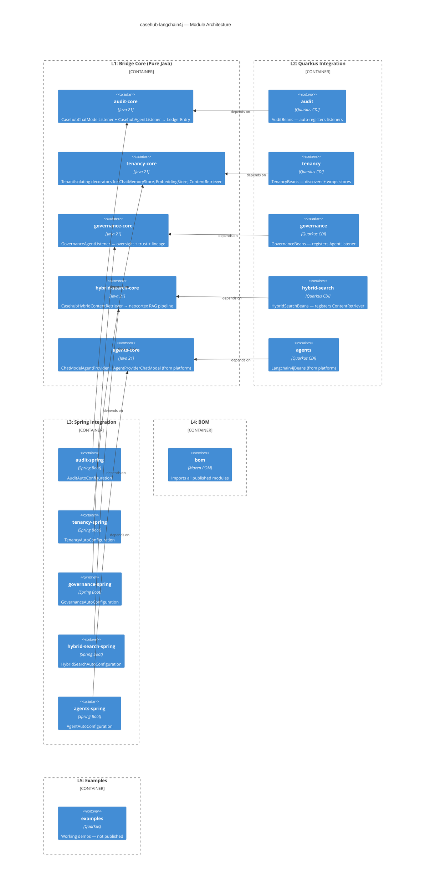
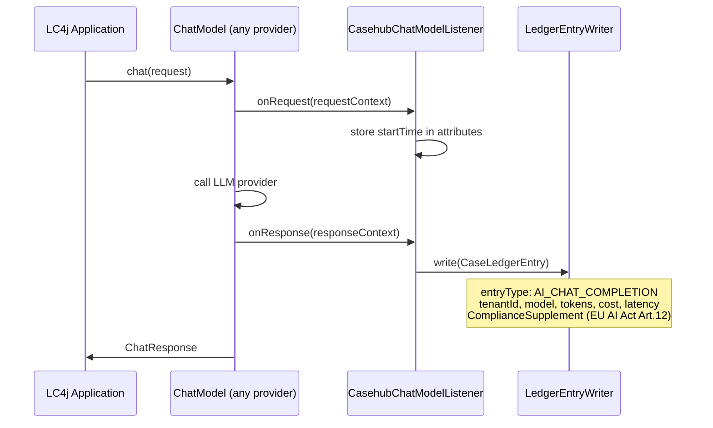
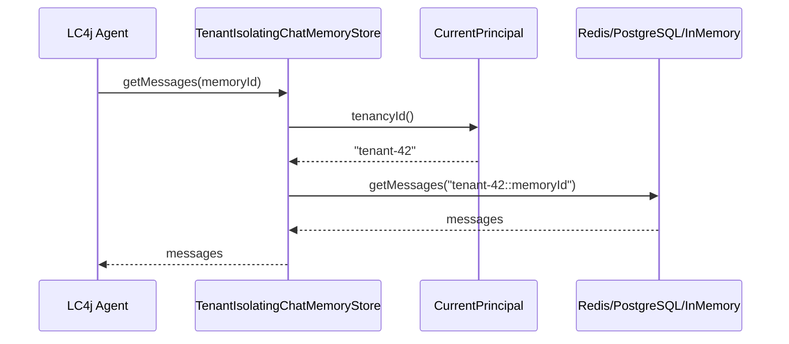
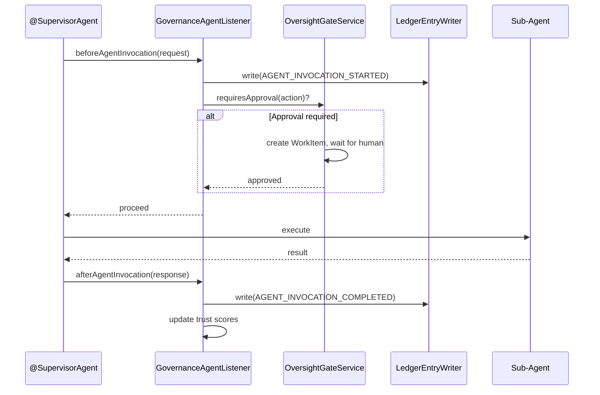
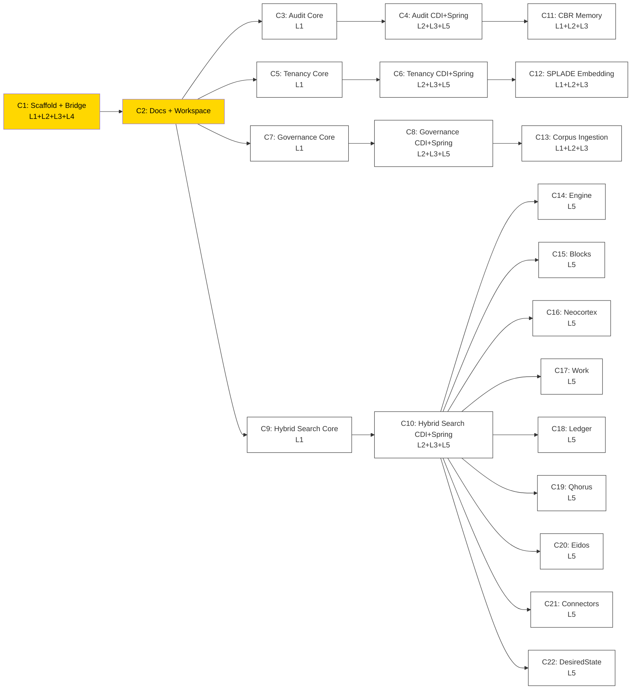

# casehub-langchain4j — ARC42STORIES.MD

**Spec:** Arc42Stories v0.1
**Profile:** CaseHub — Integration tier
**Profile ref:** `../parent/docs/arc42stories-casehub-profile.md` · fallback: `https://raw.githubusercontent.com/casehubio/parent/main/docs/arc42stories-casehub-profile.md`
**Build position:** Integration tier — depends on platform, ledger, neocortex, engine. No downstream casehubio dependents.
**Consumed by:** Application-tier repos (aml, clinical, devtown, soc, life) that want LC4j enterprise enrichment
**Depends on:** casehub-platform (agent-api, CurrentPrincipal), casehub-ledger (LedgerEntry), casehub-neocortex (rag-api, inference), casehub-engine (WorkerFunction — governance only), langchain4j-core, langchain4j-agentic

---

## §1 Introduction and Goals

### Description

`casehub-langchain4j` provides enterprise enrichment for LangChain4j applications. It is **complementary** to langchain4j, not competitive. The developer keeps their chosen LC4j providers, stores, and patterns. CaseHub wraps them with enterprise concerns that langchain4j deliberately does not handle.

Core capabilities:
- **audit** — tamper-evident `CaseLedgerEntry` for every LLM call and agent invocation. Merkle Mountain Range inclusion proofs (RFC 9162), Ed25519 checkpoint signing, EU AI Act ComplianceSupplement.
- **tenancy** — tenant-isolating decorators for `ChatMemoryStore`, `EmbeddingStore`, and `ContentRetriever`. Works with any backing implementation the developer already chose.
- **governance** — human oversight gates, trust-weighted agent routing, and causal lineage for agent invocations via `AgentListener`.
- **hybrid-search** — `ContentRetriever` implementation with SPLADE sparse + dense + RRF fusion + cross-encoder reranking. Fills an acknowledged gap in LC4j (issue #4087).

Module structure per SPI: `-core` (pure Java), bare name (Quarkus CDI), `-spring` (Spring auto-config). The agents bridge (ChatModel ↔ AgentProvider, moved from platform) is the foundation all modules build on.

### Artifact Schema

| Artifact type | Format | Example | Where it lives |
|---|---|---|---|
| Issue | `#NNN` or `casehubio/casehub-langchain4j#NNN` | `#1` | GitHub Issues |
| ADR | `ADR-NNNN` | `ADR-0001` | `docs/adr/` |
| Design spec | `YYYY-MM-DD-topic-design` | `2026-09-24-phase-1-enterprise-concerns` | workspace `specs/` |
| Blog entry | `YYYY-MM-DD-[initials]NN-title` | `2026-10-01-dt01-title` | workspace `blog/` |

Integration tier uses issue refs directly — no improvement log prefix.

### Stakeholders

| Stakeholder | Interest |
|---|---|
| LangChain4j application developers | Gain enterprise capabilities without rewriting — add a dependency, get audit/tenancy/governance |
| CaseHub application-tier repos | Consume LC4j agents as governed CaseHub workers |
| LangChain4j community | Complementary ecosystem, not competitive replacement |
| Platform team | Agent bridge correctness after migration from platform |

### Quality Goals

| Goal | Scenario |
|---|---|
| Zero forced migration | A developer using vanilla LC4j must not be required to change any code to gain enterprise enrichment |
| Graceful degradation | Every module must function (at reduced capability) when optional CaseHub deps are absent from classpath |
| Complementary positioning | No module may duplicate a capability that LC4j actively maintains — only cross-cutting concerns and acknowledged gaps |
| Classpath activation | Adding a module to the classpath is the only step. No mandatory configuration, no code changes |

---

## §2 Constraints

### Platform

Java 21 (on Java 26 JVM), Quarkus 3.32.2, LangChain4j 1.14.1. Both Quarkus and Spring auto-configuration from day one. Published to GitHub Packages as `io.casehub.langchain4j:casehub-langchain4j-*:0.2-SNAPSHOT`.

```bash
JAVA_HOME=$(/usr/libexec/java_home -v 26) mvn clean install
```

### Dependencies

Resolved from GitHub Packages: `https://maven.pkg.github.com/casehubio/*`. CI authentication via `GITHUB_TOKEN`.

Cross-repo dependencies:
- `casehub-platform-api` — `CurrentPrincipal`, `ActorType` (tenancy, audit)
- `casehub-platform-agent-api` — `AgentProvider`, `AgentSession` (agents bridge, governance)
- `casehub-ledger-api` — `CaseLedgerEntry`, `LedgerEntryWriter`, `ComplianceSupplement` (audit, governance)
- `casehub-neocortex-rag-api` — `CaseContextRetriever` (hybrid-search)
- `casehub-engine-api` — `WorkerFunction`, `OversightGateService` (governance, optional)
- `langchain4j-core` — `ChatModelListener`, `ChatMemoryStore`, `EmbeddingStore`, `ContentRetriever`
- `langchain4j-agentic` — `AgentListener`, `AgentRequest`, `AgentResponse`, `AgenticScope`

### Module-tier rules

- `*-core/` — zero framework dependency. No Quarkus, no Spring, no CDI. Pure Java only. CaseHub deps marked `<optional>true</optional>` for graceful degradation.
- `*/` (Quarkus) — CDI `@DefaultBean` / `@Alternative @Priority` activation. Jandex indexed.
- `*-spring/` — Spring `@ConditionalOnClass` auto-configuration. No CDI dependency.

### Expansion policy

Any module beyond the four Phase 1 leads requires documented justification (Decision D8):
1. **Gap acknowledged** — cite a LC4j issue where maintainers acknowledge the gap
2. **Different category** — the module provides something LC4j doesn't attempt
3. **Customer requested** — a CaseHub deployer needs it

Each justification is documented in the module's README under "## Why this module exists".

---

## §3 Context and Scope

```mermaid
C4Context
  title casehub-langchain4j — System Context

  Person(lc4jDev, "LC4j Developer", "Builds LLM applications with LangChain4j")

  System_Boundary(clj, "casehub-langchain4j") {
    System(audit, "audit", "ChatModelListener + AgentListener → Ledger")
    System(tenancy, "tenancy", "Tenant-isolating decorators")
    System(governance, "governance", "Oversight gates + trust routing + lineage")
    System(hybridSearch, "hybrid-search", "SPLADE + dense + RRF ContentRetriever")
    System(agents, "agents", "ChatModel ↔ AgentProvider bridge")
  }

  System_Ext(lc4j, "LangChain4j", "ChatModel, ChatMemoryStore, EmbeddingStore, ContentRetriever, AgentListener")
  System_Ext(platform, "casehub-platform", "CurrentPrincipal, AgentProvider SPI")
  System_Ext(ledger, "casehub-ledger", "CaseLedgerEntry, Merkle proofs, Ed25519")
  System_Ext(neocortex, "casehub-neocortex", "Hybrid RAG, SPLADE, cross-encoder")
  System_Ext(engine, "casehub-engine", "OversightGateService, TrustSignalProvider")

  Rel(lc4jDev, clj, "adds dependency")
  Rel(clj, lc4j, "implements SPIs from")
  Rel(clj, platform, "depends on")
  Rel(clj, ledger, "depends on (optional)")
  Rel(clj, neocortex, "depends on (hybrid-search only)")
  Rel(clj, engine, "depends on (governance only, optional)")
```

**Boundary rules:** `casehub-langchain4j` owns enterprise enrichment of LC4j SPIs. It does NOT own:
- LC4j model providers (Ollama, OpenAI, etc.) — those are LC4j's domain
- CaseHub's own agent SPIs (`AgentProvider`, `AgentSession`) — those stay in `casehub-platform-agent-api`
- Application-level case definitions — those belong in app-tier repos
- RAG pipeline internals — those belong in `casehub-neocortex`

---

## §4 Solution Strategy

### Core architectural patterns

- **Decorator over replacement** — three of four lead modules are decorators that wrap existing LC4j implementations. The developer's chosen providers are preserved. Only hybrid-search is a replacement (justified by LC4j #4087).
- **Classpath activation** — Quarkus: `@DefaultBean` / `@Alternative @Priority`. Spring: `@ConditionalOnClass`. Adding the module to the classpath is the only step.
- **Three-module pattern** — `-core` (pure Java, no framework), bare name (Quarkus CDI), `-spring` (Spring auto-config). Matches the convention established in `casehub-platform`.
- **Graceful degradation** — every module handles missing optional deps. Ledger absent → EventLog fallback → slf4j. CurrentPrincipal absent → single-tenant passthrough. Engine absent → no oversight gates (lineage-only).
- **Optional deps via `<optional>true</optional>`** — core modules declare CaseHub deps as optional. The framework modules handle presence/absence at wiring time.

### Layer taxonomy

| Layer | Module(s) | Responsibility |
|---|---|---|
| L1: Bridge Core | `audit-core`, `tenancy-core`, `governance-core`, `hybrid-search-core`, `agents-core` | Pure Java SPI bridges — no framework deps |
| L2: Quarkus Integration | `audit`, `tenancy`, `governance`, `hybrid-search`, `agents` | CDI `@DefaultBean`/`@Alternative @Priority` wiring |
| L3: Spring Integration | `audit-spring`, `tenancy-spring`, `governance-spring`, `hybrid-search-spring`, `agents-spring` | Spring `@ConditionalOnClass` auto-configuration |
| L4: BOM | `bom` | Maven BOM importing all published modules |
| L5: Examples | `examples` | Working demonstrations per module (not published) |

### Journey and Chapter sequencing rationale

- C1 before all: establishes the repo scaffold and agents bridge — every other module depends on the bridge or the build infrastructure
- C2 before C3: documentation and workspace must exist before implementation begins
- C3 before C4: audit-core must compile before CDI/Spring wiring
- C5 before C6: tenancy-core must compile before CDI/Spring wiring
- C7 before C8: governance-core must compile before CDI/Spring wiring
- C9 before C10: hybrid-search-core must compile before CDI/Spring wiring
- C3/C5/C7/C9 are independent of each other: four SPI groups have no shared runtime dependency
- C11–C13 after C3–C10: Phase 2 builds on Phase 1's established patterns
- C14–C22 after C10: Phase 3 platform capability guides require Phase 1 modules as the bridge layer. Each chapter is independent — can be written in any order based on demand. Chapters get fleshed out with more detail as treblereel approaches them.

---

## §5 Building Block View



---

## §6 Runtime View

### Audit — ChatModelListener intercepts LLM call



### Tenancy — Decorator wraps ChatMemoryStore



### Governance — AgentListener intercepts agent invocation



---

## §7 Deployment View

### Adding casehub-langchain4j to an existing LC4j project

```xml
<!-- Add audit — zero code changes needed -->
<dependency>
    <groupId>io.casehub.langchain4j</groupId>
    <artifactId>casehub-langchain4j-audit</artifactId>
    <version>${casehub.version}</version>
</dependency>

<!-- Add tenancy — zero code changes needed -->
<dependency>
    <groupId>io.casehub.langchain4j</groupId>
    <artifactId>casehub-langchain4j-tenancy</artifactId>
    <version>${casehub.version}</version>
</dependency>

<!-- Or import the BOM for everything -->
<dependencyManagement>
    <dependencies>
        <dependency>
            <groupId>io.casehub.langchain4j</groupId>
            <artifactId>casehub-langchain4j-bom</artifactId>
            <version>${casehub.version}</version>
            <type>pom</type>
            <scope>import</scope>
        </dependency>
    </dependencies>
</dependencyManagement>
```

The developer's existing LC4j configuration, model providers, and application code remain unchanged. Enterprise capabilities activate on classpath presence.

---

## §8 Crosscutting Concepts

### Graceful degradation

Every module follows a three-tier degradation pattern:

| Tier | Condition | Behaviour |
|---|---|---|
| Full | CaseHub dep on classpath + bean resolvable | Enterprise feature active |
| Reduced | CaseHub dep on classpath + bean missing | Fallback (e.g. EventLog instead of Ledger) |
| Passthrough | CaseHub dep absent | Module no-ops, logs warning once at startup |

Implementation: `-core` modules accept nullable constructor args. Framework modules use `Instance<T>.isResolvable()` (CDI) or `@ConditionalOnBean` (Spring) to probe.

### Tenant propagation

All tenant-aware modules obtain tenant identity from `CurrentPrincipal.tenancyId()` (casehub-platform-api). The tenant ID is:
- Prefixed onto memory IDs (tenancy module)
- Added as metadata to embeddings (tenancy module)
- Included in every ledger entry (audit module)
- Propagated through AgenticScope (governance module)

If `CurrentPrincipal` is absent, single-tenant mode applies — no prefix, no metadata, no tenant field in ledger entries.

### Ledger integration pattern

Modules that write ledger entries follow the same pattern:

1. Accept `LedgerEntryWriter` (optional) and `EventLog` (optional) via constructor
2. Build `CaseLedgerEntry` with all required fields
3. Attempt `ledgerWriter.write(entry)` → if unavailable, `eventLog.append(entry)` → if unavailable, `log.info(entry)`
4. Never throw from the degradation path — the primary operation (LLM call, memory access, agent invocation) must succeed even if audit recording fails

---

## §9 Journeys and Chapters

### §9.1 Journey Overview

| Journey | Description | Chapters | Status |
|---|---|---|---|
| J1: Foundation | Repo scaffold, agents bridge (from platform), CI, BOM, workspace, docs | C1–C2 | 🔲 |
| J2: Enterprise Concerns — Audit | `ChatModelListener` + `AgentListener` → tamper-evident `CaseLedgerEntry` | C3–C4 | 🔲 |
| J3: Enterprise Concerns — Tenancy | Tenant-isolating decorators for stores and retrievers | C5–C6 | 🔲 |
| J4: Enterprise Concerns — Governance | `AgentListener` → oversight gates + trust routing + causal lineage | C7–C8 | 🔲 |
| J5: Enterprise Implementation — Hybrid Search | `ContentRetriever` with SPLADE + dense + RRF (justified by LC4j #4087) | C9–C10 | 🔲 |
| J6: Enterprise Implementations — Extended (Phase 2) | CBR memory, SPLADE embedding, corpus ingestion — each with documented justification | C11–C13 | 🔲 |
| J7: Platform Capability Guide (Phase 3) | Systematic walkthrough of the full CaseHub platform through an LC4j lens — engine, blocks, neocortex, work, ledger, qhorus, eidos, connectors, desiredstate | C14–C22 | 🔲 |

### §9.2 Chapter Index



Legend: 🟡 In Progress | ⬜ Not Started | 🟢 Complete

| # | Chapter | Journey | Layers touched | Phase | Status |
|---|---|---|---|---|---|
| 1 | Repo Scaffold + Agents Bridge | J1 | L1, L2, L3, L4 | 1 | 🔲 |
| 2 | Workspace + Documentation | J1 | — (docs) | 1 | 🔲 |
| 3 | Audit Core | J2 | L1 | 1 | 🔲 |
| 4 | Audit Quarkus + Spring + Examples | J2 | L2, L3, L5 | 1 | 🔲 |
| 5 | Tenancy Core | J3 | L1 | 1 | 🔲 |
| 6 | Tenancy Quarkus + Spring + Examples | J3 | L2, L3, L5 | 1 | 🔲 |
| 7 | Governance Core | J4 | L1 | 1 | 🔲 |
| 8 | Governance Quarkus + Spring + Integration | J4 | L2, L3, L5 | 1 | 🔲 |
| 9 | Hybrid Search Core | J5 | L1 | 1 | 🔲 |
| 10 | Hybrid Search Quarkus + Spring + Integration | J5 | L2, L3, L5 | 1 | 🔲 |
| 11 | CBR Memory | J6 | L1, L2, L3 | 2 | 🔲 |
| 12 | SPLADE Embedding | J6 | L1, L2, L3 | 2 | 🔲 |
| 13 | Corpus Ingestion | J6 | L1, L2, L3 | 2 | 🔲 |
| 14 | Engine: Case Lifecycle and Orchestration | J7 | L5 | 3 | 🔲 |
| 15 | Blocks: Orchestration Patterns and Annotations | J7 | L5 | 3 | 🔲 |
| 16 | Neocortex: Cognitive Capabilities | J7 | L5 | 3 | 🔲 |
| 17 | Work: Task Management and Human Review | J7 | L5 | 3 | 🔲 |
| 18 | Ledger: Trust, Compliance, and Lineage | J7 | L5 | 3 | 🔲 |
| 19 | Qhorus: Channels and Deliberation | J7 | L5 | 3 | 🔲 |
| 20 | Eidos: Agent Identity and Personality | J7 | L5 | 3 | 🔲 |
| 21 | Connectors and Streams: External Integration | J7 | L5 | 3 | 🔲 |
| 22 | DesiredState: Fault Diagnosis and Reconciliation | J7 | L5 | 3 | 🔲 |

**Layer x Chapter matrix**

| Layer | C1 | C2 | C3 | C4 | C5 | C6 | C7 | C8 | C9 | C10 | C11 | C12 | C13 | C14 | C15 | C16 | C17 | C18 |
|---|---|---|---|---|---|---|---|---|---|---|---|---|---|---|---|---|---|---|
| L1: Bridge Core | High | — | High | — | High | — | High | — | High | — | High | High | High | — | — | — | — | — |
| L2: Quarkus | High | — | — | High | — | High | — | High | — | High | Med | Med | Med | — | — | — | — | — |
| L3: Spring | High | — | — | High | — | High | — | High | — | High | Med | Med | Med | — | — | — | — | — |
| L4: BOM | High | — | — | — | — | — | — | — | — | — | Low | Low | Low | — | — | — | — | — |
| L5: Examples | — | — | — | Med | — | Med | — | Med | — | Med | — | — | — | High | High | High | High | High |

### §9.3 Chapter Entries

#### C1 — Repo Scaffold and Agents Bridge

**Journey:** J1 | **Sequence:** 1 of 18 | **Status:** 🔲
**Spec:** `2026-09-24-casehub-langchain4j-design.md` §Module Structure

**What this delivers**
A fully functional Maven multi-module repo with the agents bridge (ChatModel ↔ AgentProvider, moved from platform) building, testing, and publishing. Consumers can depend on `casehub-langchain4j-agents` instead of `casehub-platform-agent-langchain4j`. CI dispatch chain is wired. Parent BOM includes all artifacts.

**Accountability gaps closed**
- Agent bridge scattered across platform → L1, L2, L3, L4 (consolidated in dedicated repo)
- No BOM for LC4j enrichment → L4 (BOM module)
- No CI for LC4j enrichment → CI workflow wired

**Key files**
| File | Purpose |
|---|---|
| `pom.xml` | Root parent POM with all modules |
| `agents-core/src/main/java/.../ChatModelAgentProvider.java` | ChatModel → AgentProvider (from platform) |
| `agents-core/src/main/java/.../AgentProviderChatModel.java` | AgentProvider → ChatModel (from platform) |
| `agents/src/main/java/.../Langchain4jBeans.java` | CDI wiring (from platform) |
| `bom/pom.xml` | BOM importing all published modules |
| `.github/workflows/publish.yml` | CI workflow |

**Issues**
- TBD — scaffold Maven multi-module project
- TBD — move agent-langchain4j-core from platform
- TBD — move agent-langchain4j from platform
- TBD — move agent-langchain4j-spring from platform
- TBD — update engine/blocks dependency coordinates
- TBD — CI workflow with repository_dispatch
- TBD — parent BOM entries

---

#### C2 — Workspace and Documentation

**Journey:** J1 | **Sequence:** 2 of 18 | **Status:** 🔲
**Spec:** `2026-09-24-casehub-langchain4j-design.md`

**What this delivers**
Complete workspace setup (symlinks, workspace git repo), CLAUDE.md, contributor guide, consumer guide, ARC42STORIES.MD, STRATEGY.md. Future Claude sessions can open this repo and understand the architecture, conventions, and implementation roadmap immediately.

**Accountability gaps closed**
- No workspace for new repo → workspace git repo created
- No documentation → contributor guide, consumer guide, ARC42STORIES
- No strategy articulation → STRATEGY.md explains complementary positioning

**Key files**
| File | Purpose |
|---|---|
| `CLAUDE.md` | Project configuration for Claude sessions |
| `ARC42STORIES.MD` | Architecture chapters and implementation roadmap |
| `docs/guides/contributor-guide.md` | Module architecture, conventions, expansion policy |
| `docs/guides/consumer-guide.md` | Getting started, module reference, examples |
| `STRATEGY.md` | Complementary positioning and expansion policy |

**Issues**
- TBD — workspace setup (symlinks, git init)
- TBD — CLAUDE.md with project type, build commands, work tracking
- TBD — contributor and consumer guides

---

#### C3 — Audit Core

**Journey:** J2 | **Sequence:** 3 of 18 | **Status:** 🔲
**Spec:** `2026-09-24-phase-1-enterprise-concerns.md` §audit

**What this delivers**
Pure Java `CasehubChatModelListener` and `CasehubAgentListener` that produce `CaseLedgerEntry` records for every LLM call and agent invocation. Graceful degradation: ledger → EventLog → slf4j. No framework dependency — reusable in any Java context.

**Accountability gaps closed**
- No audit trail for LC4j LLM calls → L1 (`CasehubChatModelListener`)
- No audit trail for LC4j agent invocations → L1 (`CasehubAgentListener`)
- No EU AI Act compliance evidence → L1 (`ComplianceSupplement` on every AI decision entry)
- No cost tracking → L1 (token usage, cost estimate, latency per call)

**Key files**
| File | Purpose |
|---|---|
| `audit-core/src/main/java/.../CasehubChatModelListener.java` | `ChatModelListener` → `CaseLedgerEntry` |
| `audit-core/src/main/java/.../CasehubAgentListener.java` | `AgentListener` → `CaseLedgerEntry` (inheritedBySubagents=true) |
| `audit-core/src/main/java/.../AuditEntryBuilder.java` | Shared ledger entry construction |
| `audit-core/src/test/java/.../CasehubChatModelListenerTest.java` | Unit tests with mock LedgerEntryWriter |
| `audit-core/src/test/java/.../CasehubAgentListenerTest.java` | Unit tests verifying lineage chains |

**Issues**
- TBD — CasehubChatModelListener with ledger entry fields
- TBD — CasehubAgentListener with inheritedBySubagents and causal chain
- TBD — ComplianceSupplement integration
- TBD — graceful degradation (ledger → EventLog → slf4j)
- TBD — unit tests

---

#### C4 — Audit Quarkus + Spring + Examples

**Journey:** J2 | **Sequence:** 4 of 18 | **Status:** 🔲
**Spec:** `2026-09-24-phase-1-enterprise-concerns.md` §audit

**What this delivers**
CDI beans (`AuditBeans`) and Spring auto-configuration (`AuditAutoConfiguration`) that auto-register the audit listeners on classpath presence. Integration tests proving zero-code-change activation. A working example showing a vanilla LC4j app gaining audit with one dependency.

**Accountability gaps closed**
- No classpath activation for audit → L2 (CDI), L3 (Spring)
- No integration proof → L2, L3 (`@QuarkusTest`, `@SpringBootTest`)
- No example for developers → L5 (audit example)

**Key files**
| File | Purpose |
|---|---|
| `audit/src/main/java/.../AuditBeans.java` | CDI `@Produces` for listener beans |
| `audit-spring/src/main/java/.../AuditAutoConfiguration.java` | Spring `@ConditionalOnClass` auto-config |
| `audit/src/test/java/.../AuditIntegrationTest.java` | `@QuarkusTest` verifying auto-registration |
| `examples/src/main/java/.../AuditExample.java` | Minimal working example |

**Issues**
- TBD — AuditBeans CDI producer with Instance<LedgerEntryWriter> graceful degradation
- TBD — AuditAutoConfiguration with @ConditionalOnClass/@ConditionalOnBean
- TBD — @QuarkusTest integration test
- TBD — @SpringBootTest integration test
- TBD — audit example

---

#### C5 — Tenancy Core

**Journey:** J3 | **Sequence:** 5 of 18 | **Status:** 🔲
**Spec:** `2026-09-24-phase-1-enterprise-concerns.md` §tenancy

**What this delivers**
Three pure Java decorator classes that wrap any `ChatMemoryStore`, `EmbeddingStore`, and `ContentRetriever` with tenant isolation. Tenant ID sourced from `CurrentPrincipal.tenancyId()`. Cross-tenant access is structurally impossible through the decorator. Passthrough mode when CurrentPrincipal is absent.

**Accountability gaps closed**
- No tenant isolation on LC4j stores → L1 (`TenantIsolatingChatMemoryStore`)
- No tenant isolation on LC4j retrievers → L1 (`TenantIsolatingContentRetriever`)
- No tenant isolation on LC4j embedding stores → L1 (`TenantIsolatingEmbeddingStore`)

**Key files**
| File | Purpose |
|---|---|
| `tenancy-core/src/main/java/.../TenantIsolatingChatMemoryStore.java` | Decorates `ChatMemoryStore` with tenant-prefixed memoryId |
| `tenancy-core/src/main/java/.../TenantIsolatingEmbeddingStore.java` | Decorates `EmbeddingStore` with tenant metadata filter |
| `tenancy-core/src/main/java/.../TenantIsolatingContentRetriever.java` | Decorates `ContentRetriever` with tenant filter |
| `tenancy-core/src/test/java/.../TenantIsolationTest.java` | Cross-tenant isolation verification |
| `tenancy-core/src/test/java/.../SingleTenantPassthroughTest.java` | Passthrough when CurrentPrincipal absent |

**Issues**
- TBD — TenantIsolatingChatMemoryStore (tenant-prefixed memoryId)
- TBD — TenantIsolatingEmbeddingStore (tenant metadata filter on add/search)
- TBD — TenantIsolatingContentRetriever (tenant filter on retrieve)
- TBD — cross-tenant isolation tests
- TBD — single-tenant passthrough tests

---

#### C6 — Tenancy Quarkus + Spring + Examples

**Journey:** J3 | **Sequence:** 6 of 18 | **Status:** 🔲
**Spec:** `2026-09-24-phase-1-enterprise-concerns.md` §tenancy

**What this delivers**
CDI bean discovery and wrapping: existing `ChatMemoryStore`/`EmbeddingStore`/`ContentRetriever` beans are automatically wrapped with tenant decorators. Spring `BeanPostProcessor` equivalent. Integration tests proving tenant isolation in a Quarkus and Spring deployment.

**Accountability gaps closed**
- No automatic decorator wrapping → L2 (CDI), L3 (Spring)
- No integration proof → L2, L3 (integration tests)

**Key files**
| File | Purpose |
|---|---|
| `tenancy/src/main/java/.../TenancyBeans.java` | CDI: discovers and wraps existing beans |
| `tenancy-spring/src/main/java/.../TenancyAutoConfiguration.java` | Spring: BeanPostProcessor wrapping |
| `tenancy/src/test/java/.../TenancyIntegrationTest.java` | `@QuarkusTest` multi-tenant verification |

**Issues**
- TBD — TenancyBeans CDI discovery and wrapping
- TBD — TenancyAutoConfiguration Spring BeanPostProcessor
- TBD — multi-tenant integration tests

---

#### C7 — Governance Core

**Journey:** J4 | **Sequence:** 7 of 18 | **Status:** 🔲
**Spec:** `2026-09-24-phase-1-enterprise-concerns.md` §governance

**What this delivers**
Pure Java `GovernanceAgentListener` implementing `AgentListener` with `inheritedBySubagents() = true`. Three concerns: causal lineage (ledger entries with `causedByEntryId` chains), oversight gates (optional — blocks `beforeAgentInvocation` until human approval), trust score recording (optional — updates Bayesian Beta scores from outcomes).

**Accountability gaps closed**
- No causal lineage for LC4j agent invocations → L1 (`GovernanceAgentListener` + ledger)
- No human oversight for LC4j agent actions → L1 (OversightGateService integration)
- No trust-based agent selection → L1 (TrustSignalProvider integration)
- No tool call audit → L1 (`afterAgentToolExecution` records tool calls in lineage)

**Key files**
| File | Purpose |
|---|---|
| `governance-core/src/main/java/.../GovernanceAgentListener.java` | `AgentListener` → lineage + oversight + trust |
| `governance-core/src/main/java/.../LineageTracker.java` | Builds `causedByEntryId` chains from AgentRequest/Response |
| `governance-core/src/main/java/.../OversightGateIntegration.java` | Checks and blocks for human approval (optional) |
| `governance-core/src/main/java/.../TrustScoreRecorder.java` | Records outcomes for Bayesian Beta trust updates (optional) |
| `governance-core/src/test/java/.../GovernanceAgentListenerTest.java` | Unit tests with mock gate and trust services |

**Issues**
- TBD — GovernanceAgentListener with inheritedBySubagents
- TBD — LineageTracker (causedByEntryId chains)
- TBD — OversightGateIntegration (optional, blocks beforeAgentInvocation)
- TBD — TrustScoreRecorder (optional, updates from afterAgentInvocation)
- TBD — unit tests with mock services

---

#### C8 — Governance Quarkus + Spring + Integration

**Journey:** J4 | **Sequence:** 8 of 18 | **Status:** 🔲
**Spec:** `2026-09-24-phase-1-enterprise-concerns.md` §governance

**What this delivers**
CDI/Spring wiring that auto-registers the `GovernanceAgentListener`. Integration test: a LC4j `@SupervisorAgent` with governance listener active — verify ledger entries appear with correct causal chains, oversight gate pauses execution, and trust scores are updated.

**Accountability gaps closed**
- No automatic governance activation → L2 (CDI), L3 (Spring)
- No end-to-end proof → L5 (integration test with real supervisor)

**Key files**
| File | Purpose |
|---|---|
| `governance/src/main/java/.../GovernanceBeans.java` | CDI: registers GovernanceAgentListener |
| `governance-spring/src/main/java/.../GovernanceAutoConfiguration.java` | Spring: auto-registers listener |
| `governance/src/test/java/.../GovernedSupervisorTest.java` | `@QuarkusTest` with @SupervisorAgent + governance |

**Issues**
- TBD — GovernanceBeans CDI registration
- TBD — GovernanceAutoConfiguration Spring registration
- TBD — governed supervisor integration test (lineage + oversight + trust)

---

#### C9 — Hybrid Search Core

**Journey:** J5 | **Sequence:** 9 of 18 | **Status:** 🔲
**Spec:** `2026-09-24-phase-1-enterprise-concerns.md` §hybrid-search
**Justification:** LC4j issue [#4087](https://github.com/langchain4j/langchain4j/issues/4087) — acknowledged gap

**What this delivers**
`CasehubHybridContentRetriever` implementing LC4j's `ContentRetriever`. Delegates to neocortex's `CaseContextRetriever` for SPLADE sparse + dense + RRF fusion + optional cross-encoder reranking. Maps between LC4j `Query`/`Content` types and neocortex retrieval types.

**Accountability gaps closed**
- LC4j has no hybrid search → L1 (`CasehubHybridContentRetriever`)
- LC4j has no SPLADE → L1 (neocortex SPLADE integration)
- LC4j has no RRF fusion → L1 (neocortex Qdrant server-side RRF)

**Key files**
| File | Purpose |
|---|---|
| `hybrid-search-core/src/main/java/.../CasehubHybridContentRetriever.java` | `ContentRetriever` → neocortex RAG pipeline |
| `hybrid-search-core/src/main/java/.../QueryMapper.java` | LC4j `Query` → neocortex retrieval request |
| `hybrid-search-core/src/main/java/.../ContentMapper.java` | Neocortex results → LC4j `Content` list |
| `hybrid-search-core/src/test/java/.../CasehubHybridContentRetrieverTest.java` | Unit tests with mock CaseContextRetriever |

**Issues**
- TBD — CasehubHybridContentRetriever implementing ContentRetriever
- TBD — QueryMapper (LC4j Query → neocortex)
- TBD — ContentMapper (neocortex → LC4j Content)
- TBD — unit tests

---

#### C10 — Hybrid Search Quarkus + Spring + Integration

**Journey:** J5 | **Sequence:** 10 of 18 | **Status:** 🔲
**Spec:** `2026-09-24-phase-1-enterprise-concerns.md` §hybrid-search

**What this delivers**
CDI/Spring wiring for `CasehubHybridContentRetriever`. Integration test with Testcontainers Qdrant verifying actual hybrid search retrieval with SPLADE + dense.

**Accountability gaps closed**
- No classpath activation for hybrid search → L2 (CDI), L3 (Spring)
- No end-to-end proof with real Qdrant → L5 (Testcontainers integration test)

**Key files**
| File | Purpose |
|---|---|
| `hybrid-search/src/main/java/.../HybridSearchBeans.java` | CDI: registers CasehubHybridContentRetriever |
| `hybrid-search-spring/src/main/java/.../HybridSearchAutoConfiguration.java` | Spring: auto-registers retriever |
| `hybrid-search/src/test/java/.../HybridSearchIntegrationTest.java` | `@QuarkusTest` with Testcontainers Qdrant |

**Issues**
- TBD — HybridSearchBeans CDI registration
- TBD — HybridSearchAutoConfiguration Spring registration
- TBD — Testcontainers Qdrant integration test

---

#### C11 — CBR Memory (Phase 2)

**Journey:** J6 | **Sequence:** 11 of 18 | **Status:** 🔲
**Spec:** `2026-09-24-phase-2-enterprise-implementations.md` §CBR Memory
**Justification:** Different category — case-based reasoning is not a competing `ChatMemoryStore`

**What this delivers**
A `ChatMemoryStore` implementation backed by neocortex's CBR memory — case-based reasoning with outcome tracking, retention policies, trust-weighted retrieval. This is not a Redis/PostgreSQL competitor; it's a different category of memory that learns from past interactions.

**Issues**
- TBD — CBR-backed ChatMemoryStore bridge
- TBD — outcome tracking integration
- TBD — CDI + Spring wiring

---

#### C12 — SPLADE Embedding (Phase 2)

**Journey:** J6 | **Sequence:** 12 of 18 | **Status:** 🔲
**Spec:** `2026-09-24-phase-2-enterprise-implementations.md` §SPLADE Embedding
**Justification:** No JVM SPLADE implementation exists outside neocortex

**What this delivers**
An `EmbeddingModel` implementation providing SPLADE sparse embeddings alongside dense. The only JVM-native SPLADE implementation. Runs ONNX models in-process — no external API dependency.

**Issues**
- TBD — SPLADE EmbeddingModel bridge
- TBD — ONNX model loading and inference
- TBD — CDI + Spring wiring

---

#### C13 — Corpus Ingestion (Phase 2)

**Journey:** J6 | **Sequence:** 13 of 18 | **Status:** 🔲
**Spec:** `2026-09-24-phase-2-enterprise-implementations.md` §Corpus Ingestion
**Justification:** Enterprise document lifecycle (versioning, provenance, change tracking) is a different category from LC4j's basic Tika support

**What this delivers**
`DocumentLoader`/`DocumentSplitter` implementations backed by neocortex's `CorpusIngestionService` with tenant-scoped corpus management, versioning, provenance tracking, and change detection.

**Issues**
- TBD — corpus-backed DocumentLoader/DocumentSplitter
- TBD — tenant-scoped corpus management
- TBD — CDI + Spring wiring

---

#### C14 — Engine: Case Lifecycle and Orchestration (Phase 3)

**Journey:** J7 | **Sequence:** 14 of 22 | **Status:** 🔲
**Spec:** Phase 3 spec (to be detailed as Phase 3 approaches)

**What this delivers**
Guide and examples showing LC4j developers how to use casehub-engine's case lifecycle, goal model, binding evaluator, stage gating, workers, and loop control. LC4j agents become workers in governed case instances. The execution kernel (routing, binding, milestones, goals) orchestrates when and how agents are invoked.

**Key capabilities:** CaseContext, EventLog, Goal/GoalKind, CasePlanModel, PlanItem, Stage binding, LoopControl, WorkerProvisioner, SubCase coordination.

**Issues**
- TBD — engine case lifecycle guide + example

---

#### C15 — Blocks: Orchestration Patterns and Annotations (Phase 3)

**Journey:** J7 | **Sequence:** 15 of 22 | **Status:** 🔲

**What this delivers**
Guide showing LC4j developers how CaseHub's annotation-driven orchestration patterns (@Supervisor, @Sequence, @Parallel, @Debate, @Voting) relate to LC4j's patterns. How to use both side by side — LC4j for internal agent logic, CaseHub annotations for external orchestration with governance meta-annotations (@OversightGate, @TrustRouted, @Attestation).

**Key capabilities:** ExecutionModel<T>, 5 composable SPIs (routing, decomposition, activation, aggregation, termination), governance meta-annotations, HTN planning.

**Issues**
- TBD — blocks orchestration patterns guide + example

---

#### C16 — Neocortex: Cognitive Capabilities (Phase 3)

**Journey:** J7 | **Sequence:** 16 of 22 | **Status:** 🔲

**What this delivers**
Guide showing LC4j developers how to leverage neocortex's full cognitive stack: CBR memory (case-based reasoning with outcome learning), hybrid RAG (SPLADE + dense + cross-encoder), ONNX inference (NLI, classification, regression), cognitive observability, corpus management. Each capability accessible from LC4j code via the bridges established in Phases 1–2.

**Key capabilities:** CaseContextRetriever, CbrRecordStore, SparseEmbedder, CrossEncoderReranker, NliClassifier, TextClassifier, CognitionTraceService, CorpusIngestionService.

**Issues**
- TBD — neocortex cognitive capabilities guide + example

---

#### C17 — Work: Task Management and Human Review (Phase 3)

**Journey:** J7 | **Sequence:** 17 of 22 | **Status:** 🔲

**What this delivers**
Guide showing LC4j developers how to use casehub-work's task management alongside LC4j agents: WorkItems, SLA enforcement (breach policies, escalation), human review workflows, work queues, approval chains. LC4j agents operate within managed workflows — timers, failure rerouting, dead letter queues are transparent.

**Key capabilities:** WorkItem, SlaBreachPolicy, WorkQueue, EscalationService, HumanProvisioner, DeadLetterQueue, RetryPolicy.

**Issues**
- TBD — work task management guide + example

---

#### C18 — Ledger: Trust, Compliance, and Lineage (Phase 3)

**Journey:** J7 | **Sequence:** 18 of 22 | **Status:** 🔲

**What this delivers**
Guide showing LC4j developers the full ledger capability beyond basic audit: trust scoring (Bayesian Beta, EigenTrust), attestation chains, W3C PROV-DM lineage export, GDPR Art.17 token-severing erasure, EU AI Act compliance supplements. How trust scores drive agent selection and how lineage chains prove decisions.

**Key capabilities:** TrustSignalProvider, AttestationPolicy, CaseLedgerEntry, ComplianceSupplement, ErasureReceiptLedgerEntry, W3C PROV-DM export.

**Issues**
- TBD — ledger trust and compliance guide + example

---

#### C19 — Qhorus: Channels and Deliberation (Phase 3)

**Journey:** J7 | **Sequence:** 19 of 22 | **Status:** 🔲

**What this delivers**
Guide showing LC4j developers how to use Qhorus channels for structured inter-agent communication: named channels, large artefact sharing, wait_for_reply semantics, peer-to-peer coordination. LC4j agents participate in structured debate — propose, critique, synthesise positions with auditable outcomes.

**Key capabilities:** QhorusChannel, share_data/get_shared_data, wait_for_reply, MessageLedgerEntry, deliberation patterns.

**Issues**
- TBD — qhorus channels and deliberation guide + example

---

#### C20 — Eidos: Agent Identity and Personality (Phase 3)

**Journey:** J7 | **Sequence:** 20 of 22 | **Status:** 🔲

**What this delivers**
Guide showing LC4j developers how to give their agents rich identity: system prompt rendering with semantic enrichment (identity, role, capability, disposition, goal narratives), personality composition, knowledge graph-backed reputation, Wilson lower-bound scoring. LC4j agents become identifiable, trackable entities with evolving reputations.

**Key capabilities:** SystemPromptRenderer, PersonalityComposition, AgentGoals, AgentConstraints, Disposition, epistemic confidence via ScalarRegressor.

**Issues**
- TBD — eidos agent identity guide + example

---

#### C21 — Connectors and Streams: External Integration (Phase 3)

**Journey:** J7 | **Sequence:** 21 of 22 | **Status:** 🔲

**What this delivers**
Guide showing LC4j developers how to connect their agents to external systems via CaseHub's stream adapters (Kafka, AMQP, webhook, poll, Camel) and endpoint registry. CloudEvent-envelope throughout. LC4j agents can receive external events and produce responses through managed channels.

**Key capabilities:** StreamContext (tenancy propagation in async), EndpointRegistry, CloudEvent envelope, 5 classpath-activated transports, Slack channel backend.

**Issues**
- TBD — connectors and streams guide + example

---

#### C22 — DesiredState: Fault Diagnosis and Reconciliation (Phase 3)

**Journey:** J7 | **Sequence:** 22 of 22 | **Status:** 🔲

**What this delivers**
Guide showing LC4j developers how to use desired-state management for automated fault diagnosis and reconciliation loops. LC4j agents can serve as AI_REVIEW fault nodes — the LLM diagnoses faults and recommends corrective actions within a governed reconciliation loop.

**Key capabilities:** DesiredState, NodeSpec, FaultPolicy, AI_REVIEW fault node, reconciliation loop, LlmGanglion.

**Issues**
- TBD — desiredstate fault diagnosis guide + example

---

## §10 Architectural Decisions

Decisions are captured in the workspace at `specs/casehub-langchain4j/decisions.md`. Key decisions:

| # | Decision | Rationale |
|---|---|---|
| D1 | Separate repo (not fork, not platform module) | Single front door for LC4j enrichment. Clean dependency direction. |
| D2 | Flat modules with `-core`/bare/`-spring` convention | Matches established CaseHub convention (platform, neocortex) |
| D3 | Classpath activation with graceful degradation | Zero friction. Same pattern as platform CDI tiers. |
| D4 | Both Quarkus and Spring from day one | Platform has the dual-framework pattern proven. Spring community is large. |
| D5 | Decorators over replacements | CaseHub is additive, not competitive. Wraps, never replaces. |
| D6 | Four lead modules (audit, tenancy, governance, hybrid-search) | All in the "safe" column per community research — no LC4j overlap. |
| D7 | Move platform/agent-langchain4j here | Consolidates all LC4j interop. Platform keeps AgentProvider SPI. |
| D8 | Future modules require documented justification | Gap acknowledged, different category, or customer requested. |

---

## §11 Quality Requirements

| Quality | Scenario | Measure |
|---|---|---|
| Zero forced migration | Developer adds `casehub-langchain4j-audit` to their existing LC4j app | No code changes required. No configuration changes. App continues to work. Audit appears. |
| Graceful degradation | Audit module on classpath but casehub-ledger absent | Listener falls back to EventLog, then to slf4j. No exception. No startup failure. |
| Classpath isolation | Two CaseHub modules on classpath simultaneously (audit + tenancy) | No CDI ambiguity. No bean conflict. Each module operates independently. |
| Version compatibility | LangChain4j upgrades from 1.14 to 1.15 | All modules compile and pass tests. SPI method signatures are stable. |
| Tenant isolation | Two tenants share the same ChatMemoryStore | Tenant A cannot read Tenant B's messages through the tenancy decorator. |

---

## §12 Risks and Technical Debt

| Risk | Impact | Mitigation |
|---|---|---|
| LC4j version coupling | SPI signature changes break all bridges simultaneously | Pin to tested LC4j version. Run compatibility matrix in CI. |
| CDI bean priority conflicts | Multiple casehub-langchain4j modules + quarkus-langchain4j modules create ambiguous beans | Documented priority tier system. Integration tests with realistic deployment scenarios. |
| AgentListener API instability | `langchain4j-agentic` is newer than `langchain4j-core`, API may evolve | Monitor LC4j releases. Keep governance-core loosely coupled via interface adapter. |
| Scope creep | Pressure to add modules that compete with LC4j | Expansion policy (D8) requires documented justification. STRATEGY.md is the public commitment. |
| Platform module migration | Moving agent-langchain4j from platform may break downstream consumers | Coordinate with engine, blocks, openclaw. Deprecate old coordinates before removing. |

---

## §13 Glossary

| Term | Definition |
|---|---|
| Decorator | A module that wraps an existing LC4j SPI implementation to add a cross-cutting concern (audit, tenancy) without replacing the implementation |
| Graceful degradation | A module's ability to function at reduced capability when optional CaseHub dependencies are absent |
| Classpath activation | Enterprise enrichment that activates solely by adding a dependency — no code or configuration changes |
| Agents bridge | The bidirectional ChatModel ↔ AgentProvider adapter, moved from platform to this repo |
| Complementary positioning | The principle that casehub-langchain4j adds enterprise concerns LC4j deliberately doesn't handle, rather than competing with LC4j's core capabilities |
| Expansion policy | The requirement that any module beyond the four Phase 1 leads must document why it exists (gap acknowledged, different category, or customer requested) |
| SPLADE | Sparse Lexical and Expansion Model — learned sparse embeddings that expand query terms via masked language modelling |
| RRF | Reciprocal Rank Fusion — score-free fusion of ranked lists from multiple retrieval legs |
| Oversight gate | A governance mechanism that pauses agent execution until a human approver grants permission |
| Trust routing | Agent selection based on Bayesian Beta trust scores updated from attestation events and outcome history |
| Causal lineage | A chain of `CaseLedgerEntry` records linked by `causedByEntryId`, tracing every decision back to its root cause |
